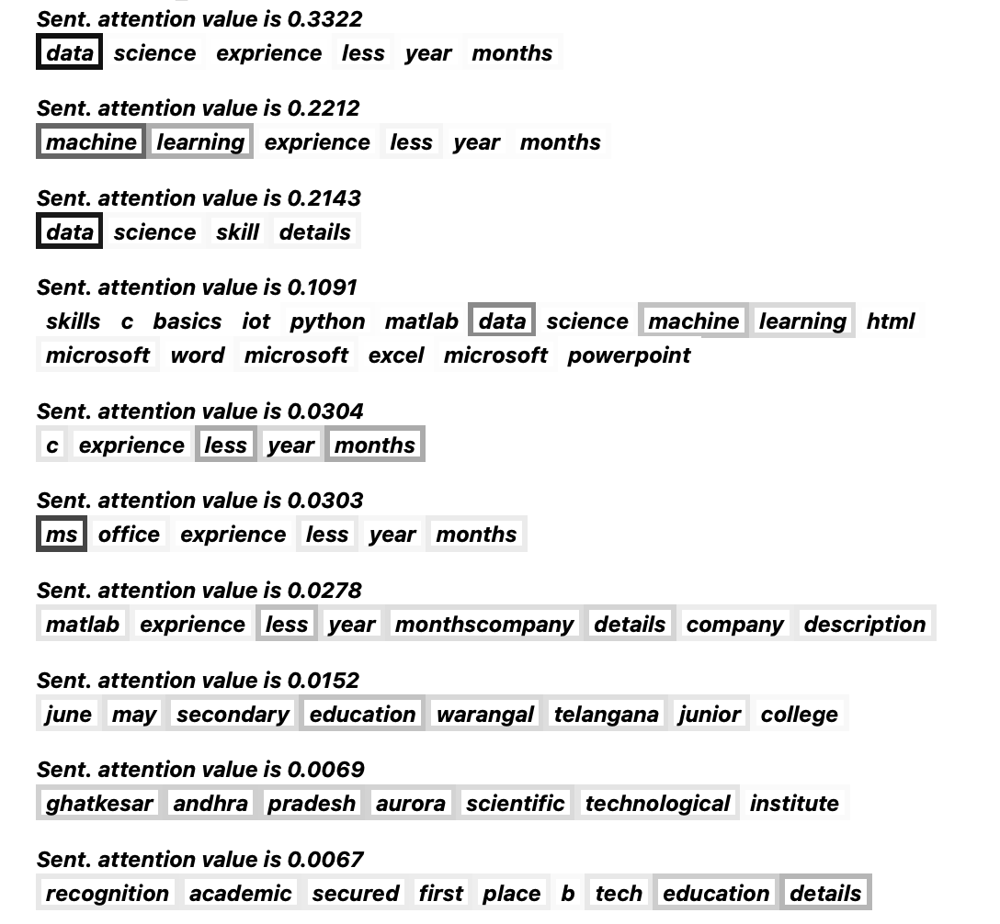
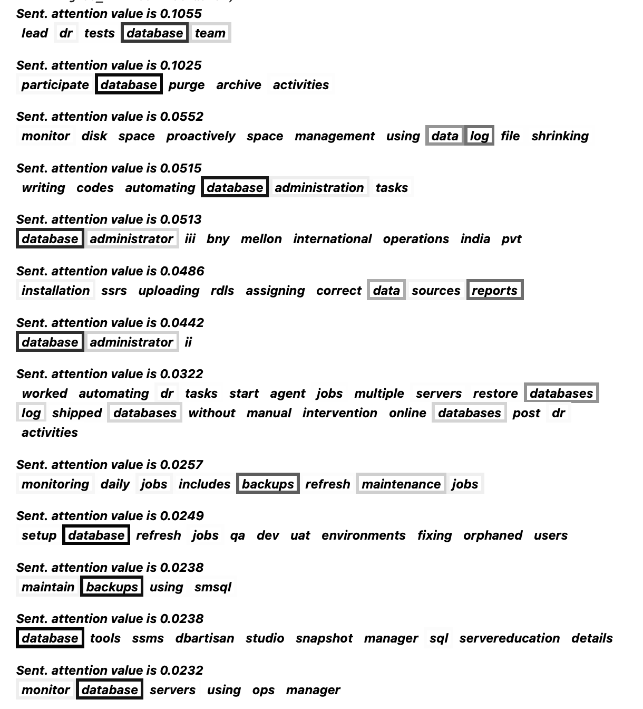
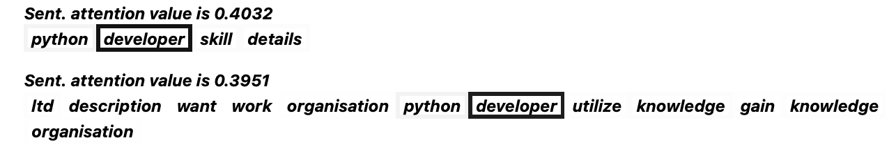

# Resume skills
Find skills from resume description.

The task to extract <i>skills words</i> from resumes. 
The idea was to use attention mechanism to mix supervised and unsupervised learning. 

I have done some research on the meaning of attention mechanism 
(<a href='https://aclanthology.org/2020.acl-main.312.pdf'>Understanding Attention for Text Classification</a>, 
<a href="https://arxiv.org/pdf/1902.10186.pdf">Attention is not Explanation</a>,
<a href="https://arxiv.org/pdf/1908.04626.pdf">Attention is not not Explanation</a>) and some researchers claim that 
"attention" captures important information from text (for nlp). 
These important features could be keywords or <i>"skills"</i> in the situation of resumes as input.

So the idea is to train a model (with attention mechanism) to classify resumes by their job title (<b>supervised learning</b>). 
In other words, the input of the model is the resume and output is category (job title). 
After this supervised training, the model will learn on which keywords it should pay more "attention" and 
these words could be our skills (<b>unsupervised learning</b>). 

I have found a <a href="https://www.kaggle.com/gauravduttakiit/resume-dataset">dataset on kaggle</a> with resumes 
and job titles (categories). This is an open source dataset and it is not perfect for completely solving this problem, 
but I do not have other resources. I have preprocessed data and used a <u>skip-gram embedding</u> algorithm to find embedding 
of the words. I have chosen this algorithm, because it captures the context of words and this is useful in our case. 

Model's architecture is <b>Hierarchical Attention Networks</b>. It was designed to deal with document structure by using 
attention firstly for words in sentences and then for sentences. So the model could choose which sentences are more 
important in a resume and also choose which words are more important. 

# Structure

- ### run.ipynb: 
jupyter notebook with all step, where developing and testing have been done.
- ### dataset_preprocess.py: 
<u>clean_text</u> and <u>dataset_preprocess</u> functions clean resume, tokenize, split on sentences and words,
plot graphs, drop duplicates, etc.
- ### embeddings.py
<u>Embedding</u> class is skip-gram model. 

<u>Optimizer</u> class is optimizer for embedding skip-gram model.

<u>create_embeddings</u> function to create vocabulary, corpus, word_to_ind, ind_to_word, ind_to_freq 
(with static parameters EMBEDDING_DIM = 64, window_size = 3)
- ### dataset.py
<u>ResumeDataset</u> class is torch.utils.data.Dataset obj for storing data (customized for our data).

<u>create_dataset</u> function create <u>train_df</u> and <u>test_df</u> with <u>train_split = 0.85</u>

- ### HAN.py
<u>WordAttention</u> class for word attention for Hierarchical Attention Networks.

<u>SentenceAttention</u> class for sentence attention for Hierarchical Attention Networks.

<u>HAN</u> class for Hierarchical Attention Networks.

<u>train</u> function is training PyTorch model.

<u>sentence_color</u> function get sentence, attention for words in this sentence and attention value for this sentence
and return colored text (format of html string)

<u>attention_print</u> function imitate model's forward run to track attention for words and sentences for coloring them
by <u>sentence_color</u> function.

# Examples

Example on training samples. Saved examples are in folder html (pdf and html variants).

There are some of them:

<b>Example for data science:</b>

Here we can see that model emphasize words "data", "machine learning", "ms office".

<b>Example for database admin:</b>

Here we can see that model emphasize words "database", "data log", "database administrator", "report", "backups".

<b>Example for python developer:</b>

Here we can see that model emphasize words "developer", "python".
